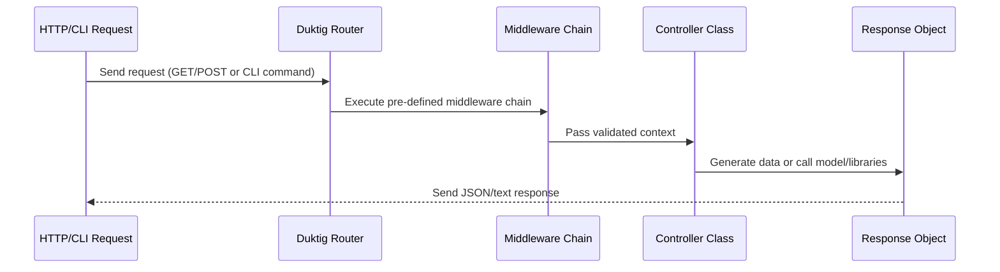

# Duktig PHP Microservice - Development documentation

## HTTP and CLI Routing

The Routing System in Duktig PHP Microservice defines how HTTP and CLI requests are resolved and executed.
It connects Request paths → Middleware → Controllers, forming the core execution pipeline of the framework.

---

### Overview

The routing configuration files are located in:

```
/app/config/http-routes.php   # Defines all REST endpoints
/app/config/cli-routes.php    # Defines CLI commands
```

Each file returns a PHP array describing available routes, their HTTP method (for web), or command name (for CLI), and the sequence of components to execute.

---

### HTTP Routing

#### Location

```
/app/config/http-routes.php
```

Structure

```php
return [
    'METHOD' => [
        '/path/{param}' => [
            'middleware' => [ 'ClassName->methodName', ... ],
            'controller' => 'ClassName->methodName',
            'permissionsRequired' => [ ... ],
            'cacheConfig' => 'ConfigName'
        ]
    ]
];
```

Explanation of keys

| Key | Description |
|-----|--------------|
| **METHOD** | HTTP method (`GET`, `POST`, `PUT`, `PATCH`, `DELETE`) |
| **Route Path** | The URL pattern to match. Variables like `{id}`, `{num}`, `{any}` allow dynamic segments. |
| **middleware** | Optional list of middleware classes/methods executed before the controller. Used for authentication, validation, caching, etc. |
| **controller** | Defines the final target handler. Format: `ClassName->methodName`. Controllers are stored under `/app/controllers`. |
| **permissionsRequired** | Optional. Defines service → permissions required to access the route. Works together with middleware-based authentication. |
| **cacheConfig** | Optional. Enables automatic system-level caching defined in the application configuration (usually Redis). |


⸻

Variables in Route Paths


| Variable | Description | Example |
|-----------|--------------|----------|
| `{id}` | Integer-only parameter | `/user/{id}` → `/user/45` valid; `/user/test` invalid |
| `{num}` | Numeric (int or float) | `/price/{num}` → `/price/12.5` valid |
| `{any}` | String type (alphanumeric, underscores, etc.) | `/post/{any}` → `/post/my-title` valid |


If a route pattern does not match, Duktig returns HTTP 404 (Resource not found) automatically.

---

#### Middleware

Middleware are executed before the controller.
Each is defined as ClassName->methodName and located in /app/middleware.

Middleware can perform tasks such as:
-	Authentication or authorization
-	Request data validation
-	Cache lookup and early response
-	Dependency preparation or injection
-	Aborting or short-circuiting the request

If middleware is an empty array, no pre-processing occurs.

---

Controllers

Controllers represent the final step in a request flow.
They are defined as ClassName->methodName under /app/controllers.

Responsibilities include:
-	Processing the request
-	Using Models or Libraries
-	Returning a response or modifying the Response object

Example:

```
'controller' => 'System\HealthCheck\SystemHealthCheck->ping'
```

This executes the ping() method inside the SystemHealthCheck class.

---

Permissions

The permissionsRequired field defines which microservice and permission IDs are necessary to access a route.

```php
'permissionsRequired' => [
    'Accounts' => [
        PERMISSIONS['Accounts']['Account']['patch'],
        PERMISSIONS['Accounts']['Account']['delete']
    ]
]
```

Note: The permissionsRequired feature must be paired with an authentication middleware that validates user roles or tokens (for example: Auth->Authenticate).

---

#### Caching

The cacheConfig directive allows automatic caching of controller responses using the system cache (Redis).

```
'cacheConfig' => 'SystemCaching'
```

Caching profiles are defined in /app/config/redis.php.

You can also implement manual caching by using middleware (pre-read) and controller logic (post-write).

---

Example: HTTP Routing

```php
'GET' => [
    '/examples/get_cached' => [
        'middleware' => [
            'Development\Auth\AuthByDeveloperKey->check'
        ],
        'controller' => 'Development\Examples\DataCaching->httpTestSystemCaching',
        'cacheConfig' => 'SystemCaching'
    ],

    '/examples/get_custom_cached' => [
        'middleware' => [
            'Development\Auth\AuthByDeveloperKey->check',
            'Development\Examples\DataCaching->responseFromCache'
        ],
        'controller' => 'Development\Examples\DataCaching->httpTestManualCaching'
    ],

    'system/ping' => [
        'middleware' => [],
        'controller' => 'System\HealthCheck\SystemHealthCheck->ping'
    ]
]
```

Explanation:
-	The first route caches automatically via SystemCaching.
-	The second performs manual caching using middleware and controller logic.
-	The third (system/ping) is an unauthenticated health endpoint.

---

### CLI Routing

Location

```
/app/config/cli-routes.php
```

Structure

```php
return [
    'command-name' => [
        'middleware' => [ 'ClassName->methodName', ... ],
        'controller' => 'ClassName->methodName',
        'executeUniqueProcessLifeTime' => 10
    ]
];
```

Usage Example

Run from CLI:

```bash
php cli/exec.php example-route --parameter1name parameter1value
```

---

Explanation of keys

| Key | Description |
|-----|--------------|
| **Route name** | The CLI command name to invoke. |
| **middleware** | Middleware classes for validation or preprocessing (for example, checking parameters). |
| **controller** | The class and method to execute. |
| **executeUniqueProcessLifeTime** | Ensures only one process runs within the given lifetime (in seconds). Prevents overlapping instances. Set to `0` to disable. |

---

Example: CLI Routes

```php
'archive-log-files' => [
    'controller' => 'System\Logs\Archiver->process',
    'middleware' => [],
    'executeUniqueProcessLifeTime' => 10
],

'db-backup' => [
    'controller' => 'System\Backups\DB->cliBackupDB'
],

'development-mq-consumer' => [
    'controller' => 'Development\MessageQueue\Consumer->consume'
]
```

Explanation:

- `archive-log-files` archives logs if they exceed a threshold.
- `db-backup` performs database backups.
- `development-mq-consumer` consumes queued messages for background processing.

---

Execution Flow Diagram



---

Best Practices

-	Separate authentication and validation logic into middleware.
-	Use consistent naming for controller methods such as get*, create*, update*, delete*.
-	Keep controllers minimal; delegate business logic to libraries or models.
-	Define executeUniqueProcessLifeTime for long-running CLI jobs to prevent race conditions.
-	Use caching for read-heavy endpoints only.
-	For reusable or pattern-based routes, consider generating them dynamically from templates.

---

### Summary

| Component | Purpose | Location |
|------------|----------|----------|
| HTTP routes | Define REST endpoints | `/app/config/http-routes.php` |
| CLI routes | Define terminal commands | `/app/config/cli-routes.php` |
| Middleware | Pre-controller logic | `/app/middleware` |
| Controllers | Request handling | `/app/controllers` |
| Permissions | Access control | `/app/config/constants.php` |
| Caching | Response storage | `/app/config/redis.php` |
