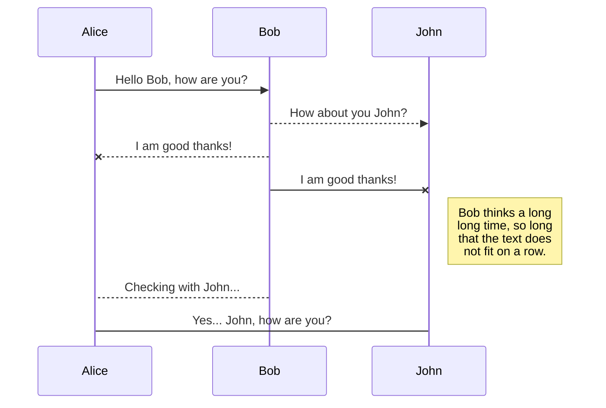
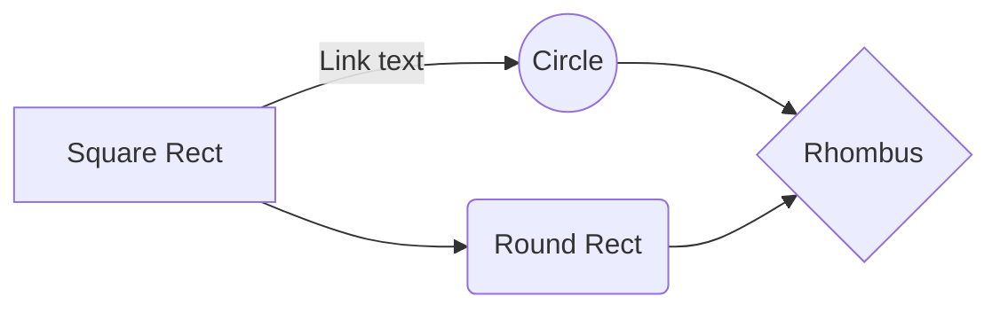

<!-- Version 1.2.0 -->

# Head 1
## Head 2
### Head 3
#### Head 4
##### Head 5

Another head
---

## Content style

This is **Bold** text\
This is ***Bold italic*** text\
This is *Italic* text
This is `Block` text

> This is quotation

## Link

[Postman Download page](https://www.getpostman.com/apps)

## Image


## List

- Item 1
- Item 2
- Item 3
    - Sub-item 1
    - Sub-item 2
- Item 4

## Table

Item|Name|Value
----|----|-----
val1|val2|val3
val4|val5|val6 

Another table with columns text left, center, right. 

| Item | Value | Name |
|:---  | :---: | ---: |
| val1 | val2  | val3 |
| val4 | val5  | val6 |

## Codes

### Json

```json
{
  "name":"David",
  "surname":"Ayvazyan",
  "email":"software@duktig.dev",
  "other_details":{
    "general_work":"Development",
    "second_work":"Server setup"
  },
  "interests":[
    "Documentary films",
    "Traveling",
    "Computer science"
  ]
}
```

### PHP

```php
<?php
// This is PHP code
function myFunc(int $a, string $b) : bool {
	
	if($a > 4 and $b != '') {
		return true;
	}
	
	return false;
}
```
## Others



And this will produce a flow chart:



End of document